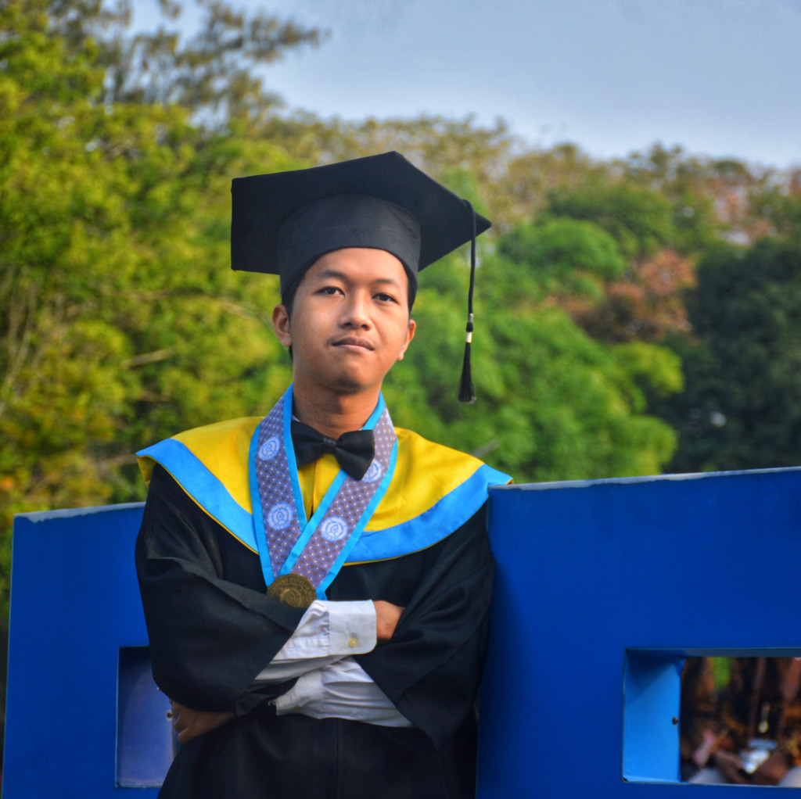

# Selamat Datang!

{: style="width: 256px; height: 256px"}

Perkenalkan saya **Michael Raditya Krisnadhi, S.Kom.**, seorang INTJ yang berprofesi sebagai _Software Engineer_. Lahir di Purwokerto tahun 2002, saya dibesarkan dan sekolah di Surakarta / Solo, dari kecil hingga kuliah. Saya merupakan alumni dari program studi S1 Informatika Universitas Sebelas Maret (UNS) Surakarta angkatan 2020, yang lulus pada tahun 2024 lalu dengan IPK 3.92 dan masa studi 4 tahun 5 bulan. Semasa sekolah dan kuliah, saya sering terlibat dalam berbagai proyek dan aktivitas sosial, yang mana sebagian besar berhubungan secara langsung dengan pengembangan karir saya. Saya merupakan orang dengan kepribadian yang tegas serta berorientasi kepada hasil dan masa depan.

Sekarang saya bekerja sebagai **Full Stack Developer** di **PT Sistem Integrasi Medika** yang berlokasi di Tangerang Selatan dan Surakarta. PT Sistem Integrasi Medika merupakan perusahaan _software_ yang bergerak di industri kesehatan di bawah naungan Primaya Hospital Group dan memiliki berbagai produk di antaranya Hospital Information System (HIS), Laboratory Information System (LIS), dan lain sebagainya. Perjalanan karir saya dimulai sejak masa SMA di mana saya terlibat mengerjakan berbagai proyek pengembangan aplikasi berbasis web untuk keperluan organisasi dan acara sekolah seperti _e-voting_, _e-ticketing_, _Computer-Based Test_ (CBT), dan lain sebagainya, yang mana kala itu saya belajar pemrograman secara otodidak. Berbagai proyek besar telah sukses saya selesaikan dalam 5+ tahun kiprah saya di dunia _software development_, selengkapnya dapat dilihat pada bagian [portfolio](portfolio.md).

Hobi saya saat ini adalah bermain _game_, menonton film & series, mendengarkan musik, dan kulineran. Saya menyukai _game_ dengan genre First-Person Shooter (FPS), strategi 4X, dan _open-world_. _Game_ yang cukup sering saya mainkan antara lain Ravenfield, Master of Orion, Civilization, Minecraft, dan Stardew Valley. Lalu saya suka menonton film & series dengan genre _crime_, _drama_, dan _sci-fi_, dengan The Godfather merupakan film favorit saya. Selera musik saya sebagian besar bernuansa _rock_ seperti Rush, The Beatles, dan Deep Purple, serta _metal_ seperti Iron Maiden, Metallica, dan Dream Theater. Aktivitas kulineran saya sebagian besar berada di wilayah Solo karena cukup dikenal dengan julukan kota kuliner, mulai dari kuliner khas yang legendaris seperti selat dan sate kambing hingga _western_ seperti _pizza_ dan _steak_.

[LinkedIn](https://linkedin.com/in/michaelrk02) | [GitHub](https://github.com/michaelrk02) | [Twitter](https://x.com/michaelrk02) | [Instagram](https://instagram.com/michaelrk02)

## Riwayat Karir

- **PT Sistem Integrasi Medika (2024 s.d. sekarang)** - Full Stack Developer (penempatan Surakarta)
- **Self-employed software developer** - Sibisa (2022), Kancani (2022), Be-Fam (2023), Narajiwa (2023), Lazuardi Al-Falah GCS Klaten (2024)
- **Digitalize (2022)** - Software Engineer (kontrak)
- **Genba Coffee (2022)** - Web Developer (kontrak)
- **Universitas Sebelas Maret (2021 s.d. 2024)** - System & Software Engineer Intern ERP Informatika UNS (1 tahun), Asisten Pengajar (4 matakuliah)

## Riwayat Pendidikan

- **Universitas Sebelas Maret (2020)** - S1 Informatika, Fakultas Teknologi Informasi dan Sains Data (FATISDA)
- **SMA Negeri 3 Surakarta (2017)** - Matematika & Ilmu Pengetahuan Alam (MIPA)
- **SMP Negeri 4 Surakarta (2014)**

## Riwayat Organisasi & Aktivitas Sosial

- **Komisi Pemilihan Raya (KPR) FMIPA UNS (2021)** - Koordinator Divisi Operasional dan Publikasi
- **Pekan Informasi dan Teknologi (PINGFEST) Informatika UNS (2021)** - Koordinator Divisi Teknologi
- **International Game Development Competition Informatika UNS (2021)** - Staf Divisi Acara
- **Himpunan Mahasiswa Ilmu Komputer / Informatika (HIMASTER) UNS (2021)** - Wakil Ketua Bidang Pengembangan Teknologi
- **IT4You Workshop Informatika UNS (2020)** - Ketua Pelaksana & Pembicara
- **OSN Informatika SMAN 3 Surakarta (2020)** - Tutor dan pembimbing olimpiade
- **Ajang Kreasi dan Seni (AKSEN) SMAN 3 Surakarta (2019)** - Staf Divisi Ticketing
- **Administrator SMAN 3 Surakarta (2017)** - Anggota, tutor, dan _technical lead_ divisi _programming_

## Riwayat Sertifikasi

- **Backend Engineer (2022)** - Startup Campus

## Riwayat Prestasi

- **Most Valuable Person (2023)** - Proyek ERP Informatika UNS
- **Hi-Movers Scholarship (2022)** - PT Bank Negara Indonesia
- **Top 500 Proposal (2022)** - Pekan Ilmiah Mahasiswa (PIM) UNS
- **Crew of The Year (2021)** - Himpunan Mahasiswa Ilmu Komputer / Informatika UNS
- **Finalis IT-Venture (2018, 2019)** - SMAN 3 Surakarta
- **Peserta OSN Komputer Tingkat Kabupaten / Kota (2018, 2019)** - SMAN 3 Surakarta

## Keahlian

- **Backend:** PHP (Laravel, CodeIgniter, Yii), Golang, Java (Spring Boot)
- **Frontend:** JavaScript (ES5/ES6), TypeScript, ReactJS (ChakraUI, MaterialUI), NextJS, VueJS, AlpineJS, jQuery, Bootstrap
- **Infrastructure:** Linux (Ubuntu, RHEL), Bash, Docker, Networking, cPanel
- **Lain-lain:** Python (General Purpose), Flutter (Mobile App Development), C/C++ (Desktop & Embedded App Development), C# (Desktop App & Game Development), Lua (Game Scripting)
- **Softskill:** Critical Thinking, Communication, Negotiation, Teamwork, Leadership
